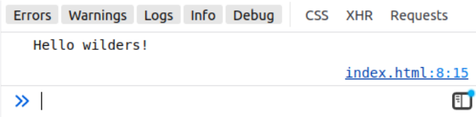

# Simple calculator

[⬅ Version FR](./README-FR)

We're going to explore the fundamentals of JavaScript by building a calculator. You will therefore learn to manipulate variables, operators, conditions...

## Setting up the workshop

Prerequisites: [JS Basics 01](https://odyssey.wildcodeschool.com/quests/1262), [JS Basics 02](https://odyssey.wildcodeschool.com/quests/1267)
{:.alert-info}

Important: the first steps must be done with your terminal!
{:.alert-warning}

Create a new `simple-calculator` folder and create an empty `index.html` file inside.

Open `index.html` with VSCode and add HTML5 structure.

In the `<body>` tag add a `<script>` tag with the following code:

```js
console.log("Hello wilders!");
```

Open the `index.html` file in a browser, and display the console (F12), what do you see? If you see your message above, it means everything is working fine!

To be sure, explain what you did to your colleagues.

### What you get

Here is the basic HTML5 structure as well as the addition of the `<script>` tag with the `console.log("Hello wilders!");` code:

```html
<!DOCTYPE html>
<html lang="en">
  <head>
    <title>Simple calculator</title>
  </head>
  <body>
    <script>
      console.log("Hello wilders!");
    </script>
  </body>
</html>
```

In the inspector:



## The first instructions

Prerequisites: [JS Basics 03](https://odyssey.wildcodeschool.com/quests/1268), [JS Basics 04](https://odyssey.wildcodeschool.com/quests/1269)
{:.alert-info}

The first step in creating our calculator is to **instantiate** variables.

Create 3 variables:

- `firstValue`: by default, the number `1` will be assigned.
- `operator`: we will use the symbol `"+"`.
- `secondValue`: we are going to assign the number `2`.

Now you will do as many `console.log` as you have variables. What do you see ?

What if we ask the user? We will use the `prompt` function (see [documentation](https://developer.mozilla.org/en-US/docs/Web/API/Window/prompt)) and assign user-chosen values to our variables. (Warning, not `operator`, just the values)

What do `console.log`s display?

### We understand the console

Add a `console.log` of `firstValue + secondValue`: what does it show? Why ? What do we have to do ? Hint: look at [this documentation](https://developer.mozilla.org/en-US/docs/Web/JavaScript/Reference/Global_Objects/parseInt).

And now, what does the `console.log` show? Why ?

To be sure, explain what you did to your colleagues.

## We work on the operator

Prerequisites: [JS Basics 05](https://odyssey.wildcodeschool.com/quests/1270)
{:.alert-info}

A little housekeeping: delete all `console.log`.

You are going to add a condition on the operator variable:

- If it contains the value `"+"` then we will _add_ the two values, store the result in a `result` variable, to be displayed in a `console.log`.
- Otherwise, in all other cases, we will _subtract_ the two values, store the result in a `result` variable, to be displayed in a `console.log`.

Explain what you did to your colleagues.

## Latest instructions

Prerequisites: [JS Basics 05](https://odyssey.wildcodeschool.com/quests/1270), ☆ [JS Basics 06](https://odyssey.wildcodeschool.com/quests/1278)
{:.alert-info}

You are almost done, now that you have made a first condition, add the conditions for _all operators_:

- Edit your code and add conditions for the `"-"`, `"*"` and `"/"` operators: consider the `else if` construct.
- In each case, display the result of the corresponding mathematical operation with a `console.log`.
- Add a default case with a final `else` that displays `"Invalid operator"`.

**☆ Bonus:** Move all code into a function to make it reusable.

# The price is right

For highly motivated people 🤘
{:.alert-warning}

## Do you like to play?

So it’s time to create a little game!

Same steps as for the part [“Setting up the workshop”](#setting-up-the-workshop), you just have to change the name of the folder.

- Ask for the name of the player.
- Store a random number between 1 and 100 (the price to find).

gift: `const rightPrice = Math.ceil(Math.random() \* 100);`
{:.alert-info}

- Ask the player for a number (between 1 and 100).
- If the number is greater than the right price, display `"It's less"`.
- If the number is less than the right price, display `"It's more"`.
- If the number is equal to the right price, display `"Well done <name> you won!"` with `<name>` replaced by the "prompted" name at the start of the game.

The game ends when it is won.
